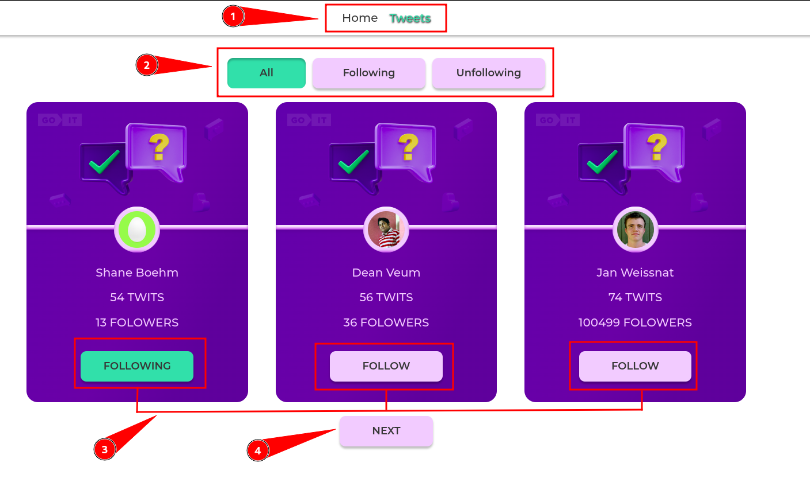

#   Tweets


 

 


### App with tweet cards and button-click interactivity.
This project was created with
[Create React App](https://github.com/facebook/create-react-app).

__Technology Stack:__ React.js, React-Router-Dom, React-Loader-spinner, React-Redux, Redux-Toolkit, Axios, Styled-Cmponent, GitHub-Pages, MockAPI. <br/>

  
  

## How it works



1. In the header, you can switch between pages using navigation.
2. You can choose which users to show (All/followed/unfollowed).
3. You can change the following status of the user, the number of his followers will also be changed.
4. 3 users are loaded on the page with each click on the "Next" button.

[ScreenCast](https://drive.google.com/file/d/18NCuH6PcjQYsLj3x-WrKDucd4ZQPg1zP/view?usp=sharing)

## Problems encountered:

The MockAPI service does not return the total number of objects in the collection, because of this, two requests are made to the server instead of one.

## Project setup

```
npm install
npm run start
```
or
```
yarn
yarn start
```
